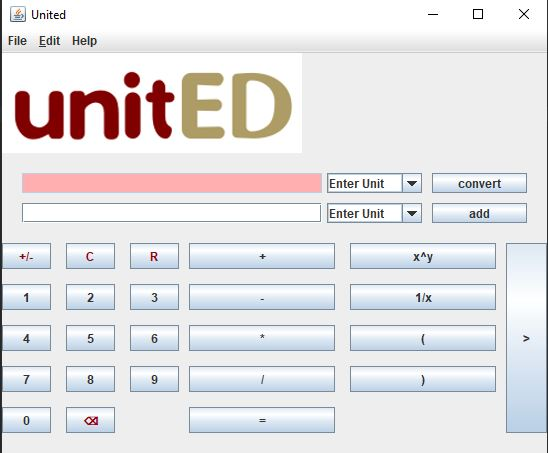
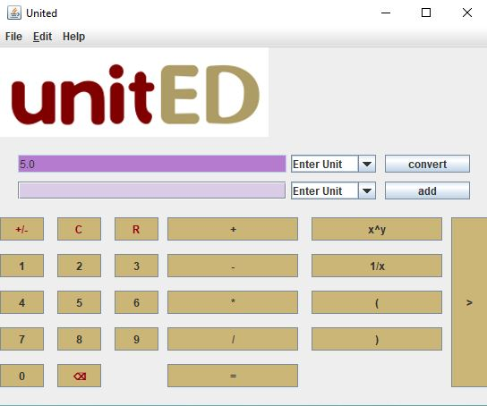
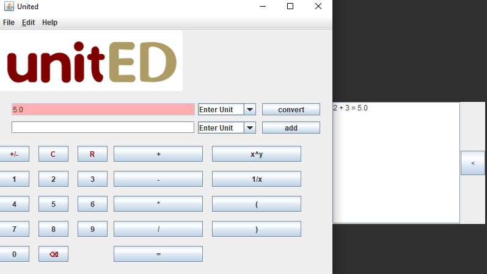

# unitED
Universal unit calculator.
This Calculator makes conversion between any unit. If unit does not exist in the 

**Interaction design:**

To change theme color, go to **File->colors** and select theme color. example:

To display the history from previous calculations, click on ">" button on the rightmost side of the keypad.
Example:

To learn more on how to use it, go to: http://w3stu.cs.jmu.edu/tuckerzp/United/United_Help.html
or **Help->Web**
